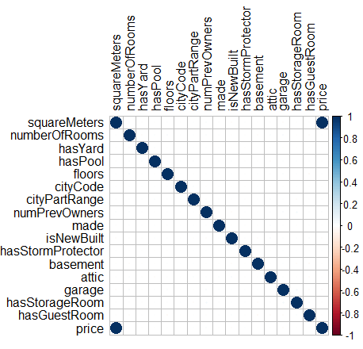
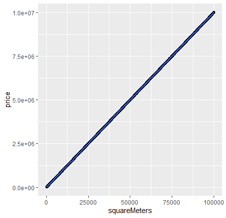
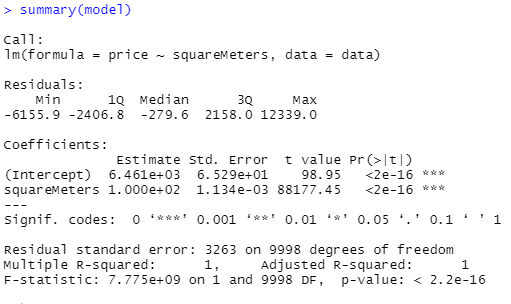
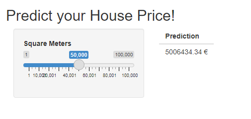

# LinearRegression_R

## Dataset :

Le dataset est composé de données fictives sur les prix des appartements de Paris avec leur caractéristiques respectifs (nombre de pièces, surface, présence d'un garage, ect...)

## Exploration des données : 

### Matrice de corrélation :

Nous commençons par tracé la matrice de corrélation afin de selectionner le ou les variable explicatives pour la création du modèle.

Nous pouvons remarquer que la surface à une corrélation de presque 1 avec le prix. Nous selectionnerons donc seuelement cette variable pour construire le modèle.

### Visualisation :

La courbe démontre bien que nous sommmes dans un problème de regression linéaire. 

## Le modèle :

### Formation et Entrainement :

`model <- lm(price ~ squareMeters, data=data)`

### Evaluation : 

Nous obtenons un pourcentage d'erreur de **0.065 %**.

## Application 

Afin de pouvoir utiliser le modèle, nous avons construit une interface graphique grâce à Shiny depuis laquelle nous pouvons prédire le prix d'un appartement en fonction de sa surface.

